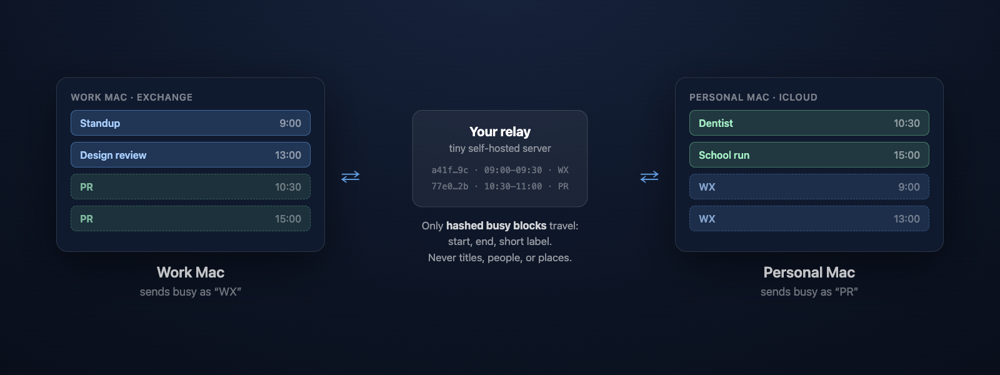

# CALSync

**Stop your Macs from double-booking each other.**

CALSync is a free, private menu bar app that syncs busy time between your own
Macs — work and personal — so every calendar knows when you're actually free.
No account, no Google, no third-party cloud: only anonymous hashed busy blocks
ever leave your machine, synced through a tiny server you host yourself.

<!-- screenshot: img/menubar.png — menu bar dropdown showing last sync + Sync Now -->

## How it works

1. **Install CALSync on each Mac** — your work Mac with its Exchange calendar,
   your personal Mac with iCloud, and so on.
2. **Pair them with one setup code.** The first Mac generates a private sync
   code automatically; copy the setup code from its Settings and paste it into
   the wizard on the others. No sign-up, no OAuth.
3. **Busy time flows both ways.** Each Mac writes title-only "busy" mirror
   events into a calendar of your choice, so anyone checking your free/busy on
   either side sees you're taken.

## Features

- Sync calendars between Macs from the menu bar — runs in the background
- Privacy-hashed sync: only start/end times, a short label, and hashed IDs
  leave the device — never titles, attendees, locations, or notes
- No account, no OAuth — pairing is a single setup code
- Self-hosted: a single-binary Bun + SQLite relay (runs anywhere, e.g. Railway)
- Exchange- and CalDAV-safe mirror markers that survive server round-trips
- Built-in Doctor diagnostics for connectivity, auth, and calendar permissions
- Signed and notarized (Developer ID); auto-updates via Sparkle
- Documented, platform-neutral sync protocol

## Privacy

What leaves your Mac: hashed identifiers, start/end timestamps, and your chosen
short display label. What never leaves your Mac: event titles, attendees,
locations, notes, calendar names, raw event IDs. The relay can't reconstruct
your schedule — it only passes opaque busy blocks between your own machines.

## Install

1. Download the latest `CALSync-x.y.z.dmg` from
   [Releases](https://github.com/itsklimov/CALSync/releases/latest).
2. Drag CALSync to Applications.
3. On first launch, grant **Calendar full access** — CALSync needs it to read
   busy times and write mirror events.
4. Follow the wizard: the first Mac just continues (it mints your sync code);
   additional Macs paste the setup code from the first Mac's Settings.

<!-- screenshots: img/wizard-connect.png, img/settings-calendars.png -->

## Requirements

- macOS 14 (Sonoma) or newer, Apple silicon or Intel (universal binary)
- A small always-on server for the relay — a free-tier Railway service or any
  box that can run Bun (single binary, SQLite storage)

## FAQ

**Does it work with Google, Exchange, iCloud, or CalDAV calendars?**
Yes — CALSync reads whatever is in Calendar.app via EventKit, and its mirror
markers survive Exchange and CalDAV round-trips.

**Can other people see my event details?**
No. Titles, attendees, and locations never leave your Mac. Mirror events on
the other Mac are title-only labels like `WX`.

**Is this for teams?**
No — CALSync syncs *one person's* multiple Macs. It's not a team scheduling
tool and doesn't sync provider-to-provider.

**Do I need an account?**
No accounts anywhere. Your sync code is the only credential, and you host the
relay yourself.

**Why is a server needed at all?**
Your Macs are rarely awake at the same time. The relay stores only hashed busy
blocks so each Mac can catch up whenever it comes online.

## More

- Protocol documentation: [protocol.md](protocol.md)
- Update feed (Sparkle appcast): https://itsklimov.github.io/CALSync/appcast.xml
